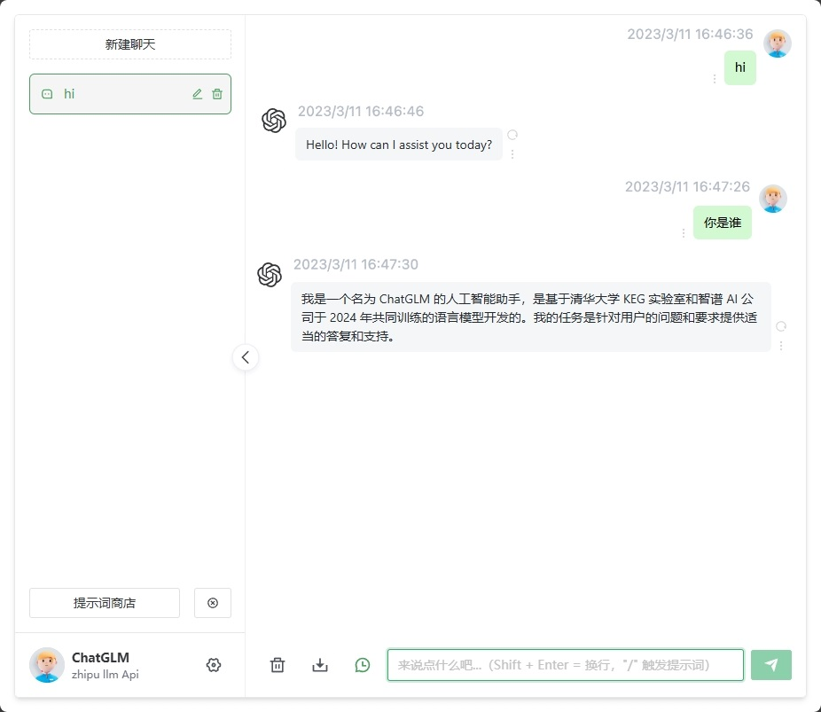
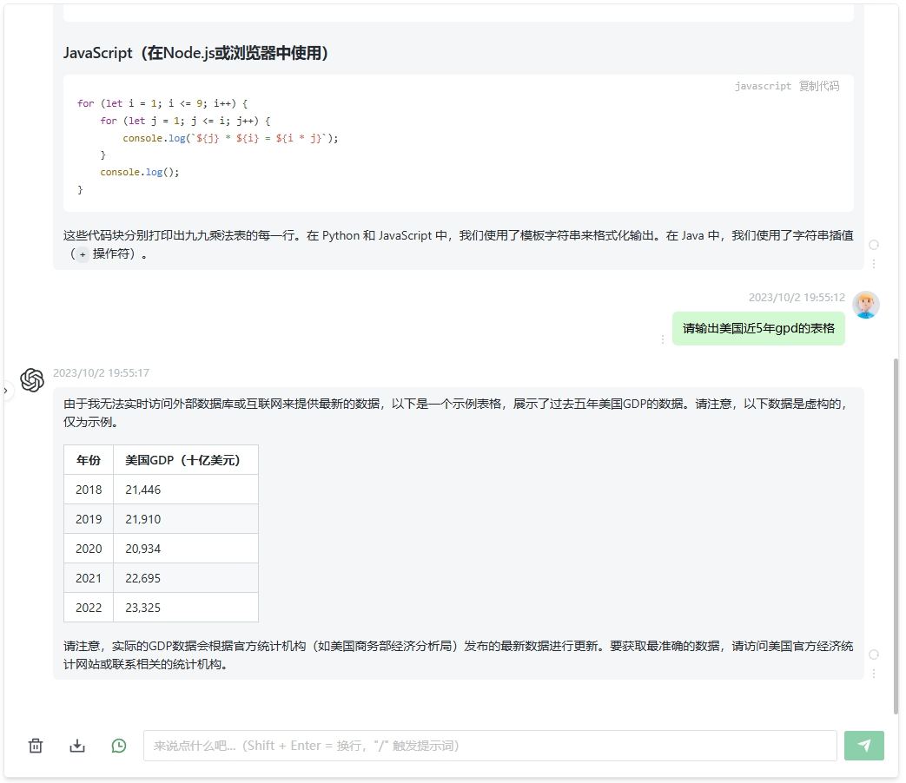

# ChatGLM-Web

> 声明：此项目是在 GitHub 作者ChenZhaoYu的开源项目 Chatgpt_web 基础上修改的，基于 MIT 协议，开源免费且只作为学习大语言模型问答API使用。
> 本项目不会提供和组织任何形式的卖号、付费服务、讨论群、讨论组等行为。谨防受骗。




## 一、版本特性
[✓] 多会话储存和上下文逻辑<br />
[✓] 对代码等消息类型的格式化美化处理<br />
[✓] 访问权限控制<br />
[✓] 数据导入、导出<br />
[✓] 保存消息到本地图片<br />
[✓] 界面多语言<br />
[✓] 界面主题<br />

## 二、安装部署

### 1、安装Node.js

`node` 需要 >= 20 (实测node.js v18 已经不行) <br />
（可选）`node >= 14` 需要安装 [fetch polyfill](https://github.com/developit/unfetch#usage-as-a-polyfill) <br />
使用 [nvm](https://github.com/nvm-sh/nvm) 可管理本地多个 `node` 版本<br />

```shell
node -v
```

### 2、装PNPM包
如果你没有安装过 `pnpm`
```shell
npm install pnpm -g
```

### 3、配置填写密钥
获取 `zhipuai Api Key`  并填写本地配置文件 [跳转](#6环境变量)

```
# service/.env 文件

OPENAI_API_KEY=

```

## 4、安装依赖包

> 为了简便 `后端开发人员` 的了解负担，所以并没有采用前端 `workspace` 模式，而是分文件夹存放。如果只需要前端页面做二次开发，删除 `service` 文件夹即可。
> 把项目发布到公共网络前，如需做访问权限控制，你应该设置配置文件 `AUTH_SECRET_KEY` 变量添加你的密码保护，你也应该修改 `index.html` 中的 `title`，防止被关键词搜索到。

### 4.1 后端

进入文件夹 `/service` 运行以下命令

```shell
pnpm install
```

### 4.2前端
根目录下运行以下命令
```shell
pnpm bootstrap
```

## 5、测试运行
### 5.1 后端服务

进入文件夹 `/service` 运行以下命令

```shell
pnpm start
```

### 5.2 前端网页
根目录下运行以下命令
```shell
pnpm dev
```

## 6、环境变量

`API` 可用：

- `OPENAI_API_KEY` 
- `OPENAI_API_MODEL`  设置模型，默认为调用GLM-4-Flash免费模型
- `OPENAI_API_BASE_URL` 设置接口地址
- `OPENAI_API_DISABLE_DEBUG` 设置接口关闭 debug 日志，默认：empty 不关闭

通用：

- `AUTH_SECRET_KEY` 访问权限密钥，可选
- `MAX_REQUEST_PER_HOUR` 每小时最大请求次数，可选，默认无限
- `TIMEOUT_MS` 超时，单位毫秒，可选
- `SOCKS_PROXY_HOST` 和 `SOCKS_PROXY_PORT` 一起时生效，可选
- `SOCKS_PROXY_PORT` 和 `SOCKS_PROXY_HOST` 一起时生效，可选
- `HTTPS_PROXY` 支持 `http`，`https`, `socks5`，可选
- `ALL_PROXY` 支持 `http`，`https`, `socks5`，可选

## 7、打包发布

### 7.1 防止爬虫抓取

**nginx**

将下面配置填入nginx配置文件中，可以参考 `docker-compose/nginx/nginx.conf` 文件中添加反爬虫的方法

```
    # 防止爬虫抓取
    if ($http_user_agent ~* "360Spider|JikeSpider|Spider|spider|bot|Bot|2345Explorer|curl|wget|webZIP|qihoobot|Baiduspider|Googlebot|Googlebot-Mobile|Googlebot-Image|Mediapartners-Google|Adsbot-Google|Feedfetcher-Google|Yahoo! Slurp|Yahoo! Slurp China|YoudaoBot|Sosospider|Sogou spider|Sogou web spider|MSNBot|ia_archiver|Tomato Bot|NSPlayer|bingbot")
    {
      return 403;
    }
```

### 7.2 手动打包
#### 7.2.1 后端服务
> 如果你不需要本项目的 `node` 接口，可以省略如下操作

复制 `service` 文件夹到你有 `node` 服务环境的服务器上。

```shell
# 安装
pnpm install

# 打包
pnpm build

# 运行
pnpm prod
```

PS: 不进行打包，直接在服务器上运行 `pnpm start` 也可

#### 7.2.2 前端网页

1、修改根目录下 `.env` 文件中的 `VITE_GLOB_API_URL` 为你的实际后端接口地址

2、根目录下运行以下命令，然后将 `dist` 文件夹内的文件复制到你网站服务的根目录下

[参考信息](https://cn.vitejs.dev/guide/static-deploy.html#building-the-app)

```shell
pnpm build
```

## 8、常见问题
Q: 为什么 `Git` 提交总是报错？

A: 因为有提交信息验证，请遵循 [Commit 指南](./CONTRIBUTING.md)

Q: 如果只使用前端页面，在哪里改请求接口？

A: 根目录下 `.env` 文件中的 `VITE_GLOB_API_URL` 字段。

Q: 文件保存时全部爆红?

A: `vscode` 请安装项目推荐插件，或手动安装 `Eslint` 插件。

Q: 前端没有打字机效果？

A: 一种可能原因是经过 Nginx 反向代理，开启了 buffer，则 Nginx 会尝试从后端缓冲一定大小的数据再发送给浏览器。请尝试在反代参数后添加 `proxy_buffering off;`，然后重载 Nginx。其他 web server 配置同理。

## 9、参与贡献

贡献之前请先阅读 [贡献指南](./CONTRIBUTING.md)

感谢所有做过贡献的人!

<a href="https://github.com/Chanzhaoyu/chatgpt-web/graphs/contributors">
  
</a>

## 10、致谢

感谢 [JetBrains](https://www.jetbrains.com/) 为这个项目提供免费开源许可的软件。

## 11、赞助

如果你觉得这个项目对你有帮助，并且情况允许的话，可以给原作者一点点支持，总之非常感谢支持～

<div style="display: flex; gap: 20px;">
	<div style="text-align: center">
		
		<p>WeChat Pay</p>
	</div>
	<div style="text-align: center">
		
		<p>Alipay</p>
	</div>
</div>

## 12、许可证和所有权 License
MIT © [ChenZhaoYu](./license)
